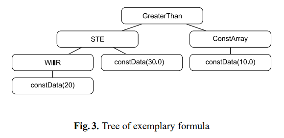

# Etap 1 - analiza problemu i dziedziny

## Problem
Tematyka projektu skupia się na inwestycjach giełdowych.

## Analiza
Początkowo myśleliśmy o podejmowaniu decyzji na podstawie liniowej kombinacji metryk i sprawdzaniu czy ta suma jest większa/mniejsza od pewnej wartości.
Nasze podejście pozwala na tworzenie mało rozbudowanych strategii.

Przeczytaliśmy znaleziony przez nas artykuł [Classical and Agent-Based Evolutionary Algorithms for Investment Strategies Generation](https://www.researchgate.net/publication/225685928_Classical_and_Agent-Based_Evolutionary_Algorithms_for_Investment_Strategies_Generation) (DOI:10.1007/978-3-540-95974-8_9).
Omawia on wykorzystanie algorytmów ewolucyjnych do generowania strategii inwestowania.

Wyróżniającą cechą jest reprezentacja, która pozwala na tworzenie złożonych strategii.
Strategia przedstawiana jest za pomocą drzewa podejmującego decyzje o zakupu oraz drugim dla sprzedaży. 
Takie drzewo posiada w węzłach funkcje lub parametry funkcji a krawędzie oznaczają zależności między nimi.
Węzeł bliżej korzenia przyjmuje wynik drugiego węzła (bliższego liściom), z którym jest połączony krawędzi.
Ewaluacja zachodzi od liści drzewa, wykonując funkcję w korzeniu powinniśmy otrzymać wartość logiczną - decyzję.

Przykładowe drzewo zakupu z artykułu, równoważne GreaterThan(STE(WillR(20), 30.0), ConstArray(10.0)).

Praca porównała 3 rodzaje algorytmów ewolucyjnych:
- EA - evolutionary algorithm
- CCEA - co-evolutionary algorithm
- CoEMAS - agent-based co-evolutionary algorithm

## Podsumowanie
Bazując na artykule z sekcji Analiza będziemy rozwijali jeden z projektów:
- zaproponowanie reprezentacji osobników w sposób umożliwiający wykorzystanie ogólnych algorytmów ewolucyjnych operujących na wektorach
- uzyskanie kodu źródłowego programu, przeanalizowanie działania oraz dodanie innych algorytmów np. [Harmony Search](https://www.sciencedirect.com/science/article/pii/S1877705816318999) celem porównania wyników
