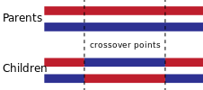
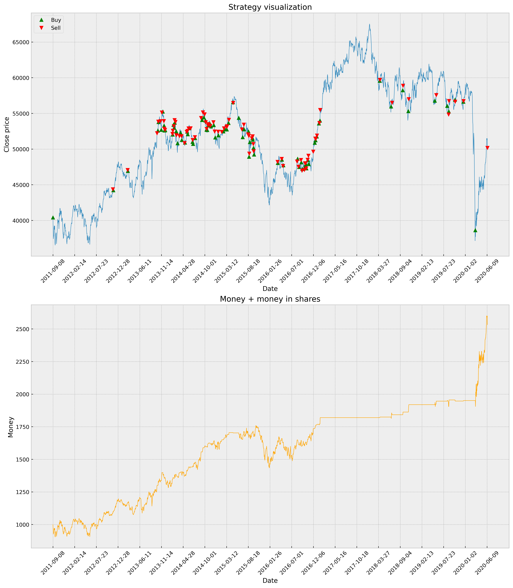

# Etap 2 - analiza i wybór narzędzi

## Temat projektu
Nie udało nam się uzyskać dostępu do kodu źródłowego z publikacji [Classical and Agent-Based Evolutionary Algorithms for Investment Strategies Generation](https://www.researchgate.net/publication/225685928_Classical_and_Agent-Based_Evolutionary_Algorithms_for_Investment_Strategies_Generation) (DOI:10.1007/978-3-540-95974-8_9) więc tematem jest "zaproponowanie reprezentacji osobników w sposób umożliwiający wykorzystanie ogólnych algorytmów ewolucyjnych operujących na wektorach".

## Narzędzia
- [ta](https://github.com/bukosabino/ta) - biblioteka zawierająca funkcje wyliczające metryki używane w analizie technicznej
- [DEAP](https://github.com/DEAP/deap/tree/master) - framework do obliczeń ewolucyjnych
- [Stooq](https://stooq.pl/) - źródło danych

Przetestowaliśmy narzędzia na wstępnym modelu dla danych historycznych indeksu WIG (14.04.2011 - 12.06.2020). 

## Wstępny model
### Preprocessing
1. odrzuciliśmy wiersze z brakującymi wartościami
2. wyznaczyliśmy wszystkie metryki dostępne w bibliotece 'ta' używając ich domyślnych parametrów
3. odrzuciliśmy dane wejściowe
4. przeskalowaliśmy metryki do przedziału [0, 1]
```python
def preprocess_data(df: pd.DataFrame) -> pd.DataFrame:
    df = dropna(df) # 1
    df = ta.add_all_ta_features(
        df, "open", "high", "low", "close", "volume"
    ) # 2
    df = df.drop(columns=['trend_psar_up', 'trend_psar_down'])  # TODO: merge or something
    df = df.tail(-100)
    columns = list(df.columns)[6:] # 3
    scaler = MinMaxScaler()
    df[columns] = scaler.fit_transform(df[columns]) # 4
    return df
```

### Osobnik
Zakodowaliśmy osobnika jako wagi z przedziału [-1, 1] dla każdej z wartości metryk.
```python
toolbox.register("attr_uniform", random.uniform, -1, 1)
toolbox.register("individual", tools.initRepeat, creator.Individual, toolbox.attr_uniform, n=ta_features_n)
```

### Fitness
Funkcja fitness opierała się na wartości $ \_eval = \sum_{i=1}^{metrics\_count} w_i * m_i $, gdzie:
- $ w_i $ - waga i-tej metryki
- $ m_i $ - wartość i-tej metryki

Symulowaliśmy zachowanie strategii posiadając dwa rodzaje zasobów: pieniądze oraz udziały.
Celem było zmaksymalizowanie pieniędzy na końcu symulacji.
```
for each day:
    if _eval > 0 and money > 0:
        buy as much as possible
    elif _eval < 0 and shares > 0:
        sell all
sell all
return money
```

```python
def evaluate(individual, _stock_data, _ta_features):
    money = 1000
    shares = 0
    for i in range(len(_ta_features) - 1):
        _eval = np.sum(_ta_features.iloc[i].to_numpy() * np.array(individual))
        if _eval > 0 and money > 0:
            shares = money / _stock_data.iloc[i]['close']
            money = 0
        elif _eval < 0 and shares > 0:
            money = shares * _stock_data.iloc[i]['close']
            shares = 0
    if shares > 0:
        money = shares * _stock_data.iloc[-1]['close']

    return money,

toolbox.register("evaluate", evaluate, _stock_data=stock_data, _ta_features=ta_features)
```

### Krzyżowanie
W chromosomie wybierane są 2 punkty, a następnie elementy dwóch osobników między tymi punktami są zamieniane.



```python
toolbox.register("mate", tools.cxTwoPoint)
```

### Mutacja
Nadpisanie każdego genu z prawdopodobieństwem `indpb` na wartość z przedziału [`low`, `up`].
Parametr `eta` definiuje podobieństwo dziecko do rodzica - wysoka wartość da potomka podobnego, niska odmiennego.

```python
toolbox.register("mutate", tools.mutPolynomialBounded, eta=10, low=-1, up=1, indpb=0.05)
```

### Selekcja
Wybiera najlepszego kandydata spośród 3 losowo wybranych osobników.

```python
toolbox.register("select", tools.selTournament, tournsize=3)
```

### Wyniki


## Dalsza praca
### Urzeczywistnić algorytm:
- uwzględnić opłaty transakcji (jeżeli da się je oszacować/uogólnić)
- przeanalizować jak na podstawie `open`, `close`, `high`, `low` wyliczyć wartość po jakiej byśmy kupowali/sprzedawali w symulacji. Obecnie przyjęliśmy `close` dla dnia, dla którego wyznaczamy decyzję handlu

### Rozwój obecnego algorytmu:
- rozważyć dodanie ograniczenia na częstotliwość wykonywania operacji, żeby uniknąć overfittingu, czyli sytuacji, w której przy najmniejszej zmianie strategia kupuje/sprzedaje. Zamiast tego chcielibyśmy, żeby strategia przewidywała trendy w dłuższym okresie czasu
- rozdzielić strategię na dwie podstrategie - jedna do zakupu, druga do sprzedaży. Obecnie podejmujemy decyzję na podstawie jednej funkcji, która przyjmując wartości < 0 decyduje o sprzedaży a przyjmując > 0 o zakupie
- zmodyfikować osobnika tak by jego strategia opierała się na wyborze metryk a następnie ich wag. Możliwe, że problematyczne będzie krzyżowanie takich osobników w sposób zachowujący cechy rodzica i obecne podejście wybierania samych wag metryk okaże się bardziej praktyczne
- sporo z dostępnych metryk przyjmuje parametry, należy rozważyć dodanie metryk z innymi parametrami niż domyślne. Można również dokonać analizy metryk - korelacja atrybutów, eliminacja mało wartościowych metryk

### Inne podejście do reprezentacji strategii
[Dokumentacja DEAP](https://deap.readthedocs.io/en/master/tutorials/advanced/gp.html) wspomina o algorytmach genetycznych na drzewach. Taka reprezentacja umożliwiłaby budowę bardziej złożonych strategii (o których była mowa w etapie [1.](../1/README.md)).
Po wstępnej analizie takie podejście wydaje się być bardziej skomplikowane i wymaga głębszego zastanowienia.
Myślimy, że warto najpierw rozwinąć obecny model by lepiej zrozumieć metryki finansowe, podejścia do reprezentacji oraz bibliotekę DEAP.
Gdy nie będziemy widzieli efektów optymalizacji obecnego modelu rozważymy zmianę reprezentacji na omawianą w tym akapicie, posiadając już wiedzę zdobytą przy rozwijaniu obecnego modelu.
