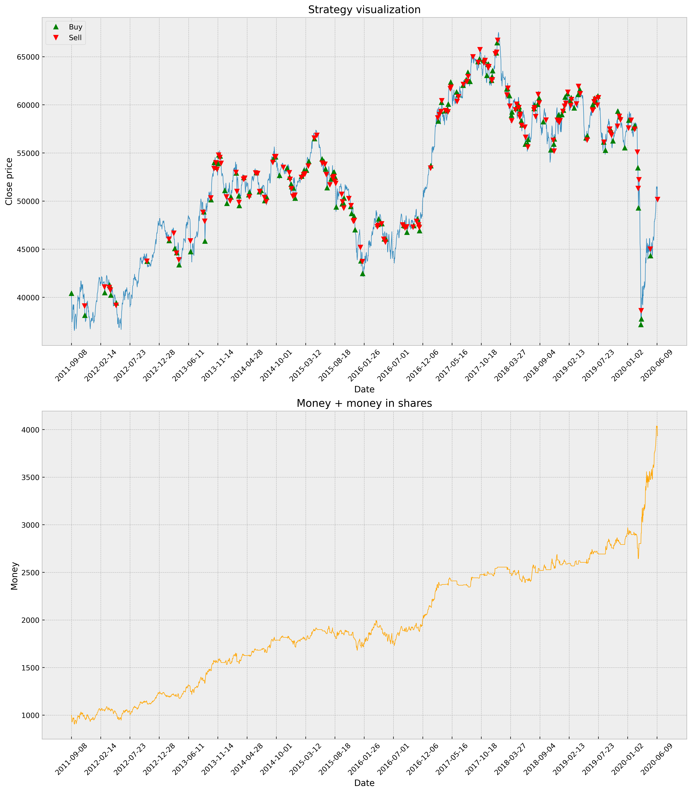
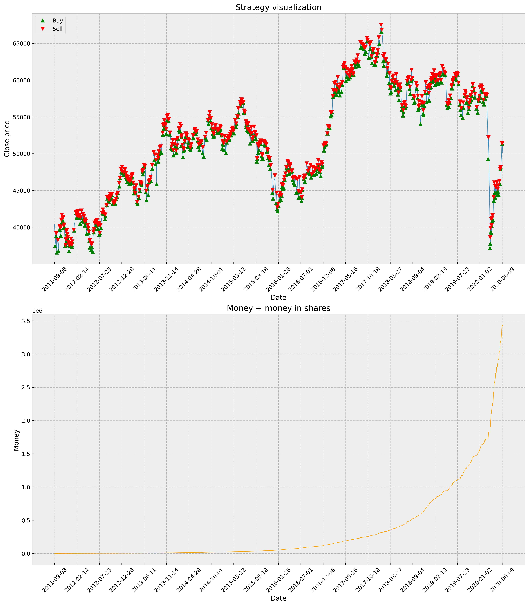

# Etap 3 - określenie celu i zakresu prac, uruchomienie narzędzi

## Zestawienie najlepszej znalezionej oraz najlepszej możliwej strategii
### Znaleziona

### Możliwa

Najlepsza znaleziona strategia dała rezultat równy ~0.1% optymalnej strategii
Po uwzględnieniu opłat za transakcje i dodaniu ograniczenia ich częstotliwości, konieczna będzie ponowna ewaluacja najlepszej strategii.
## Cele i zakres prac
- Stworzenie generatora strategii inwestycyjnych opierającego się o algorytmy optymalizacyjne inspirowane biologicznie.
- Dopracowanie modelu reprezentacji strategii, uwzględniającego punkty z akapitu ["Rozwój obecnego algorytmu" etapu 2](../2/README.md#rozwój-obecnego-algorytmu). Szczególną uwagę chcemy zwrócić na analizę wykorzystywanych metryk (korelacja atrybutów, eliminacja mało wartościowych metryk itd.). Docelowo chcielibyśmy uzyskać zbiór kilkuset metryk, poprzez wielokrotne wykorzystanie tych samych wskaźników, ale z różnymi parametrami.
- Usprawnienie funkcji kosztu tak, aby uwzględniała punkty z akapitu ["Urzeczywistnić algorytm" etapu 2](../2/README.md#rozwój-obecnego-algorytmu). 
- Porównanie algorytmów dostępnych w bibliotece DEAP, czyli EA i CMA-ES.

Biorąc pod uwagę dość szeroki zakres prac przedstawiony w powyższych punktach, zdecydowaliśmy się nie rozszerzać go jeszcze bardziej, porzucając pomysł o reprezenatacji strategii jako drzewa podejmującego decyzje.
