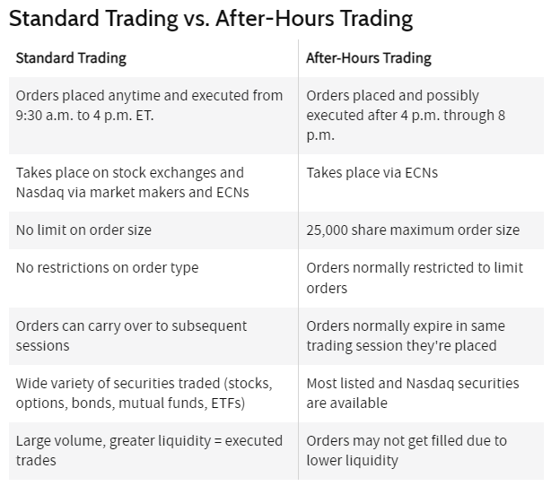
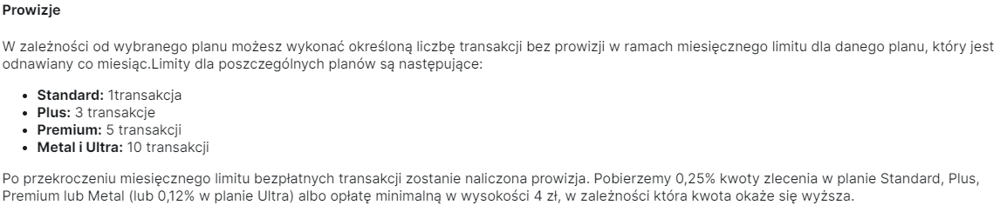
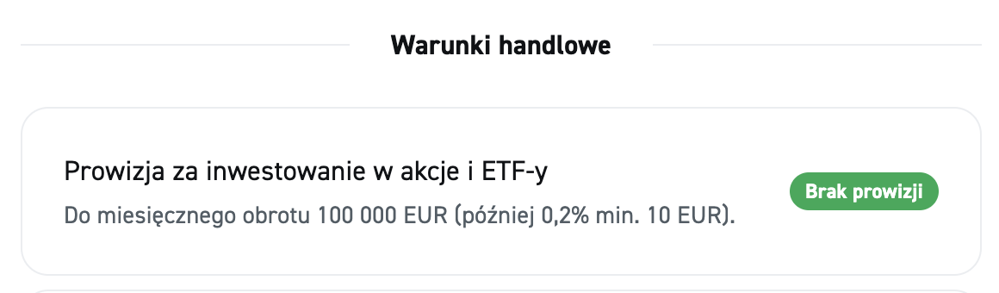
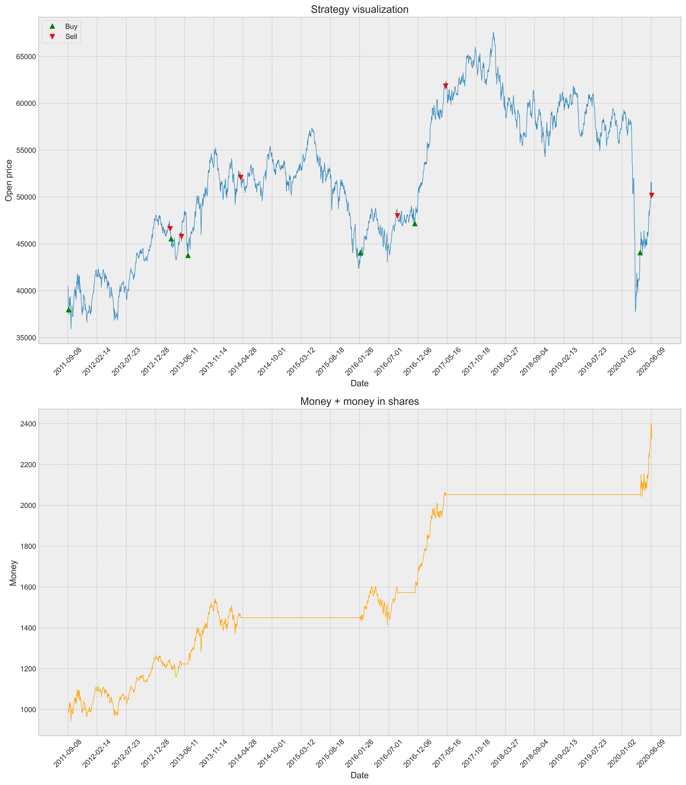
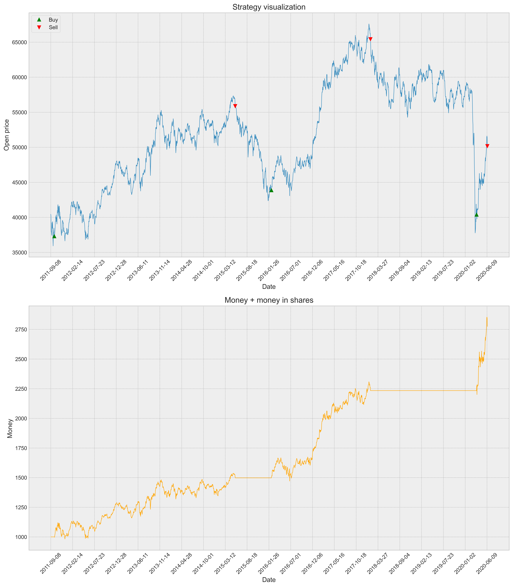
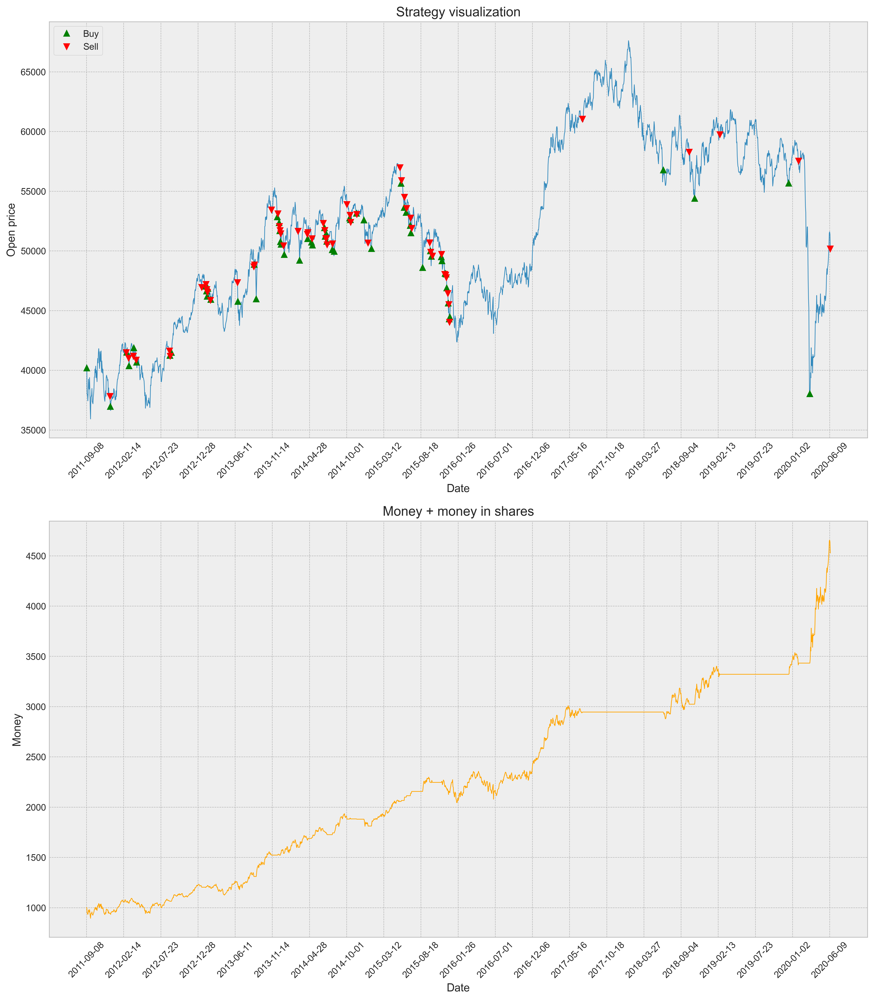
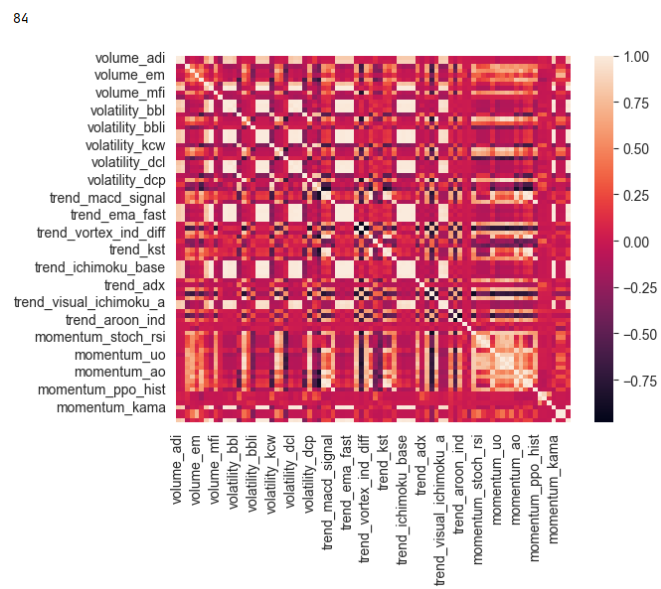
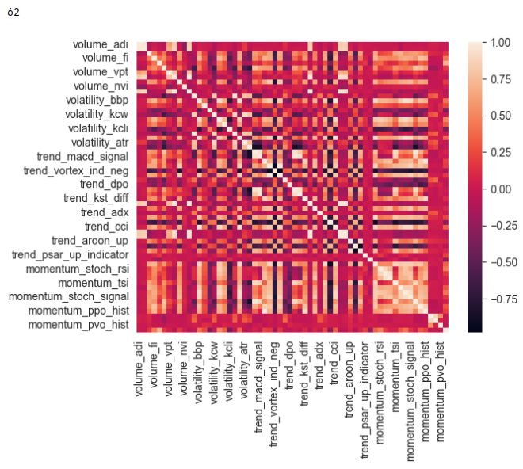

# Etap 4 - urzeczywistnienie symulacji, analiza metryk

## Urzeczywistnienie symulacji
### Wybór rodzaju ceny
Mamy do dyspozycji ceny:
- open - otwarcie
- high - max w dniu
- low - min w dniu
- close - zamknięcie

Dla high, low nie możemy być pewni czasu, dla którego występują.

Można rozważać `close` jednak nakłada to pewne ograniczenia bo wymaga użycia AHT (After-Hours Trading).

Postanowiliśmy więc używać `open`, zakładając, że dokonujemy zakupów tuż po otwarciu sesji. \
Wybraliśmy tą cenę ponieważ tylko dla niej możemy być pewni czasu, dla którego jest aktualna oraz możemy dokonać zakupu bez dodatkowych ograniczeń.

Źródła:
- [Why Don't Stocks Begin Trading at the Previous Day's Closing Price?](https://www.investopedia.com/ask/answers/139.asp)
- [After-Hours Trading](https://www.investopedia.com/terms/a/afterhourstrading.asp)

### Prowizje brokera
Prowizje różnią się między brokerami dlatego wybraliśmy przedstawiciela - Revolut. \
[System opłat](https://help.revolut.com/pl-PL/help/wealth/stocks/trading-stocks/trading-fees/what-fees-will-i-be-charged-for-my-trading/) wygląda następująco:

Na xtb jest to na przykład:

czyli niby jest za darmo ale do pewnego momentu.

Często można znaleźć informacje że niektórzy brokerzy nie pobierają prowizji, ale prawdopodobnie wiąże się 
to z innymi ukrytymi kosztami (no bo jakoś muszą zarabiać), w związku z tym zdecydowaliśmy się dodać prowizję 
jako opcjonalny parametr symulacji, który po ustawieniu pomniejsza kwotę posiadanych w symulacji pieniędzy o 
prowizję przy każdej transakcji (w przypadku kupna akcji najpierw pomniejszamy posiadane pieniądze o prowizję i 
dopiero za to "kupujemy" akcje, a w przypadku sprzedaży po zamianie akcji na pieniądze według kursu pomniejszamy
wynikową kwotę o prowizję).

Tak jak można się było spodziewać prowizje powodują, że strategia dużo rzadziej kupuje/sprzedaje akcje.
Przykładowe porównanie strategii bez prowizji i z prowizją przy takich samych pozostałych parametrach:

Prowizja 0.25%:

Prowizja 0.01%:

Bez prowizji:

Nawet przy niewielkiej prowizji 0.01% strategia kupuje/sprzedaje akcje znacznie rzadziej, ale takie podejście
ma też sporo sensu, gdyż taka strategia zdaje się lepiej przewidywać długoterminowe trendy na rynku, co w
praktyce może być bardziej użyteczne niż częste kupowanie/sprzedawanie akcji. Nie musimy wtedy praktycznie przejmować się  
prowizjami, bo są pomijalne. Dodatkowo takie rzadkie transakcje można nawet wykonywać ręcznie, a nie automatycznie.

## Metryki
### Analiza
Wykorzystaliśmy korelację Pearson do znalezienia metryk niosących podobne informacje. \
Usunęliśmy metryki mające wartość korelacji większą od pewnego thresholdu.

Przed usunięciem:

Po usunięciu:

### Generowanie
Dodaliśmy nowy parametr do modelu - zestaw metryk. \
Generujemy metryki mające losowe wartości z zadanych przedziałów.

### Połączenie
Przykładowo:
1. zaczynamy z 84 metrykami
2. generujemy i dodajemy - mamy 123
3. usuwamy mocno skorelowane - finalnie 112

Na razie dało to gorsze wyniki. Podejrzewamy, że problemem są źle dobrane zakresy parametrów metryk co będziemy dalej inwestygowali.

## Inne usprawnienia
 - Rozdzieliliśmy strategię (czyli wektor wag) na dwie części, jedna odpowiada za decyzję o kupnie, a druga o sprzedaży.
 - Przepisaliśmy niektóre funkcje z DEAP na Numpy, co pozwoliło nam na znaczne zwiększenie wydajności.
 - Dodaliśmy multi-threading, co pozwoliło na jeszcze większe przyspieszenie obliczeń, w połączeniu z poprzednim punktem.
 - Dzięki powyższym zmianom udało w tym samym czasie jesteśmy w stanie uruchomić algorytm dla większej liczby generacji oraz
   większej liczby osobników w populacji.
 - Przetestowaliśmy 2 inne strategie mutacji osobników mutGaussian i mutUniform (ten napisaliśmy sami), jednak dawały one
   gorsze wyniki niż mutPolynomialBounded, więc zdecydowaliśmy się na pozostanie przy tej strategii.
 - Zmieniliśmy też tournament_size (wcześniej było zawsze 3) tak by zależał od wielkości populacji. Teraz jest to najbliższa
   potęga 2 mniejsza niż 10% wielkości populacji. Wydaje się, że takie podejście daje lepsze wyniki, ale mamy też teraz
   możliwość zmiany tournament_size jako parametr (procent wielkości populacji).
  