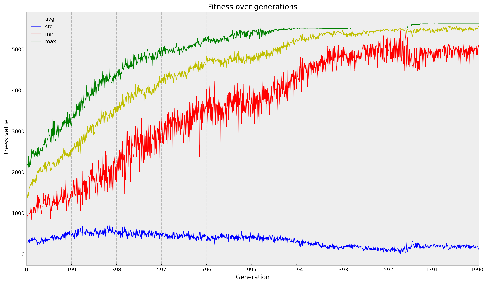

# Etap 5 - CMA-ES, wykres zbieżności funkcji fitness, większe testy
## CMA-ES
Użyliśmy implementacji CMA-ES z DEAP.

Parametry algorytmu:
- centroid - początkowy osobnik, od którego algorytm zaczyna przeszukiwanie N-wymiarowej przestrzeni. Ustawiony na np.zeros(N)
- sigma - początkowa wartość kroku algorytmu. W naszym przypadku nie powinna mieć ona większego znaczenia ponieważ w rozważanym problemie nie liczą się wartości cech a jedynie ich stosunki względem siebie. Ustawiony na 100
- lambda - liczba nowych dzieci, które są generowane. Testowaliśmy różne wartości ale większość testów przeprowadziliśmy na 100 lub 200

Reszta parametrów na razie jest domyślna ale można zbadać inne wartości.

## Wykres zbieżności funkcji fitness
Przygotowaliśmy wykres, który dla każdej generacji wyświetla jej statystyki:
- min - minimalny fitness w populacji
- max - maksymalny fitness w populacji
- avg - średni fitness w populacji
- std - odchylenie standardowe fitnessu osobników w populacji

## Większe testy
### Przygotowanie
 - możliwość uruchomienia symulacji z dowolną ilością restartów
 - zapisywanie logów z symulacji oraz najlepszej strategii na dysk
 - tworzymy plik summary.csv, w którym zapisujemy podsumowanie każdego restartu (ścieżka do danych, najlepszy wynik, liczba generacji, czas wykonania)
 - dodaliśmy heurystyki przerywające symulację jeżeli 'utknęła w miejscu'
 - odczytywanie i prezentacja odbywa się w oddzielnym notebooku. Wyświetlamy w nim ranking przeprowadzonych symulacji (summary.csv) oraz po podaniu ścieżki do wybranej symulacji możemy zobaczyć jej szczegóły (dane oraz wykresy)

### Wyniki

