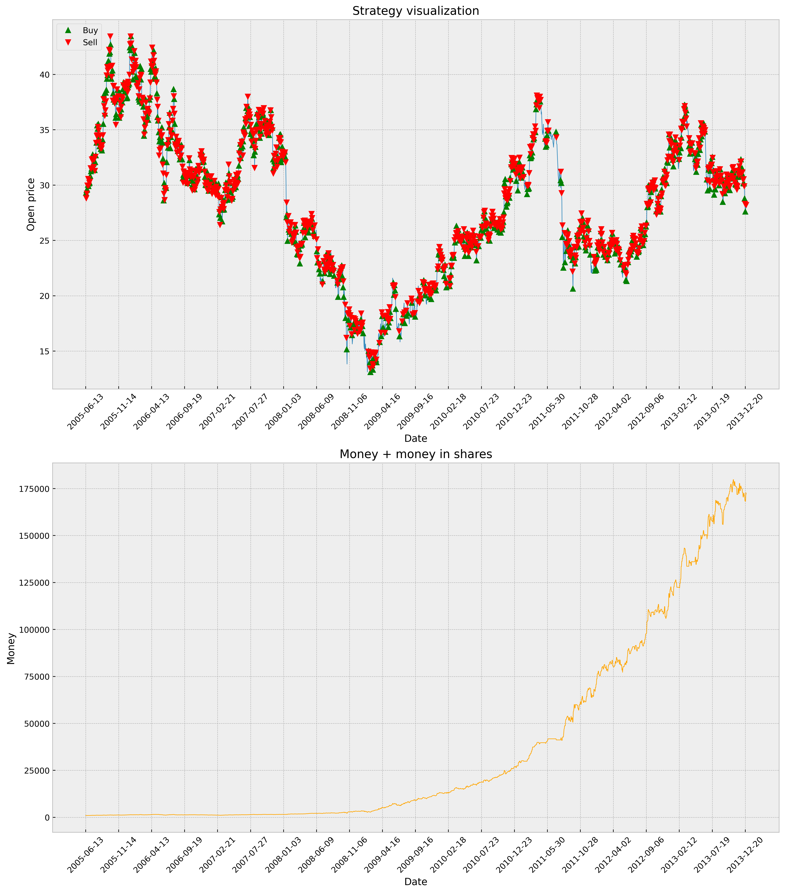
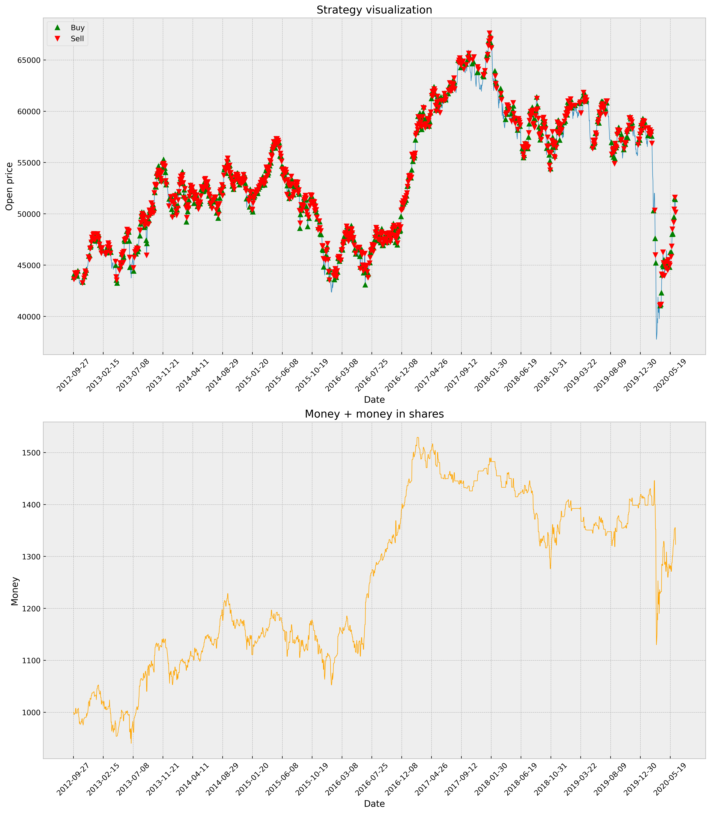
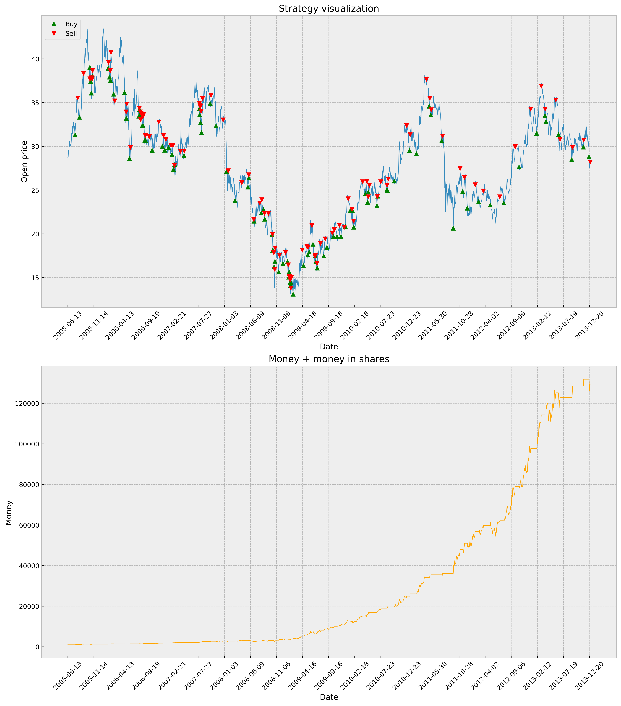
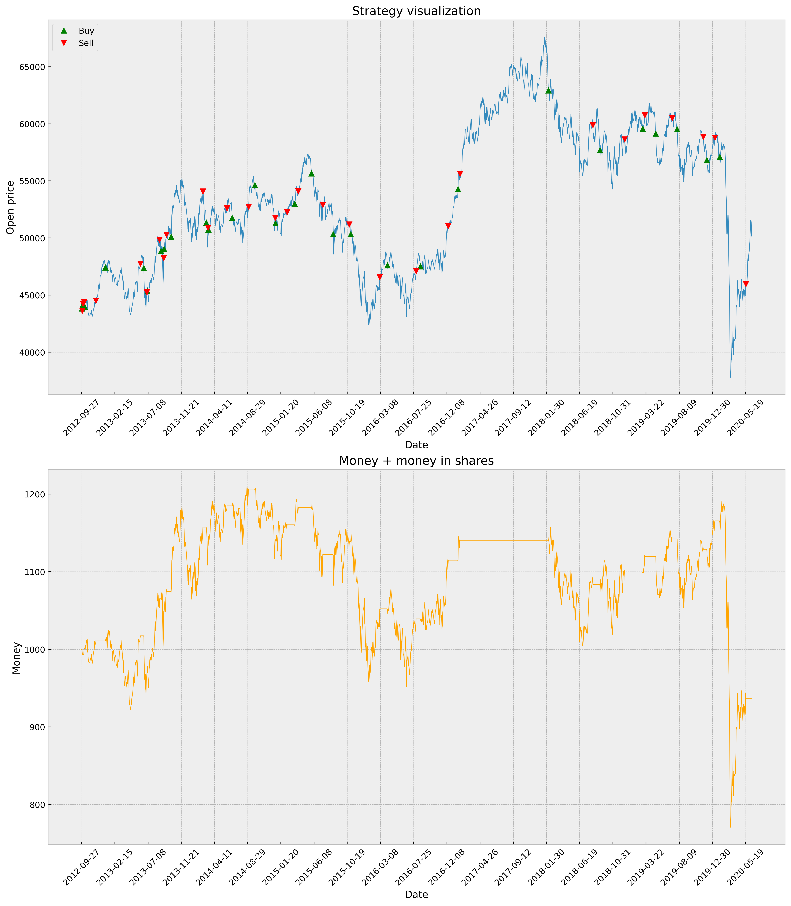
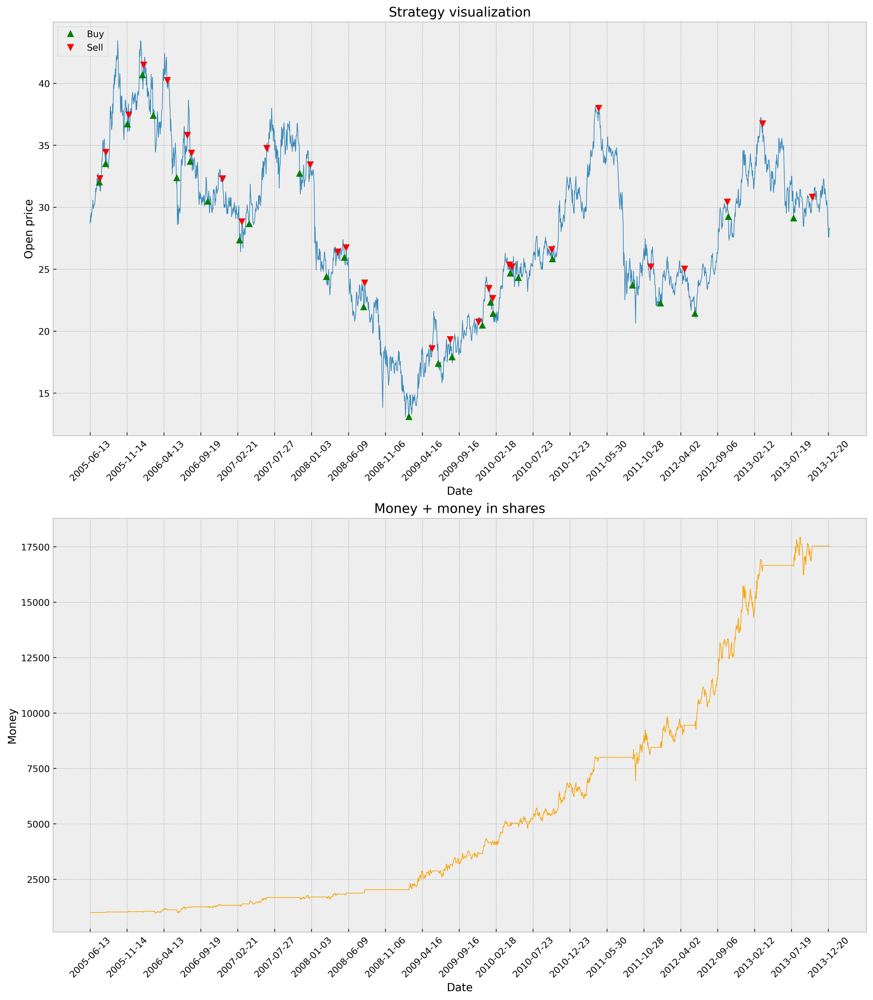
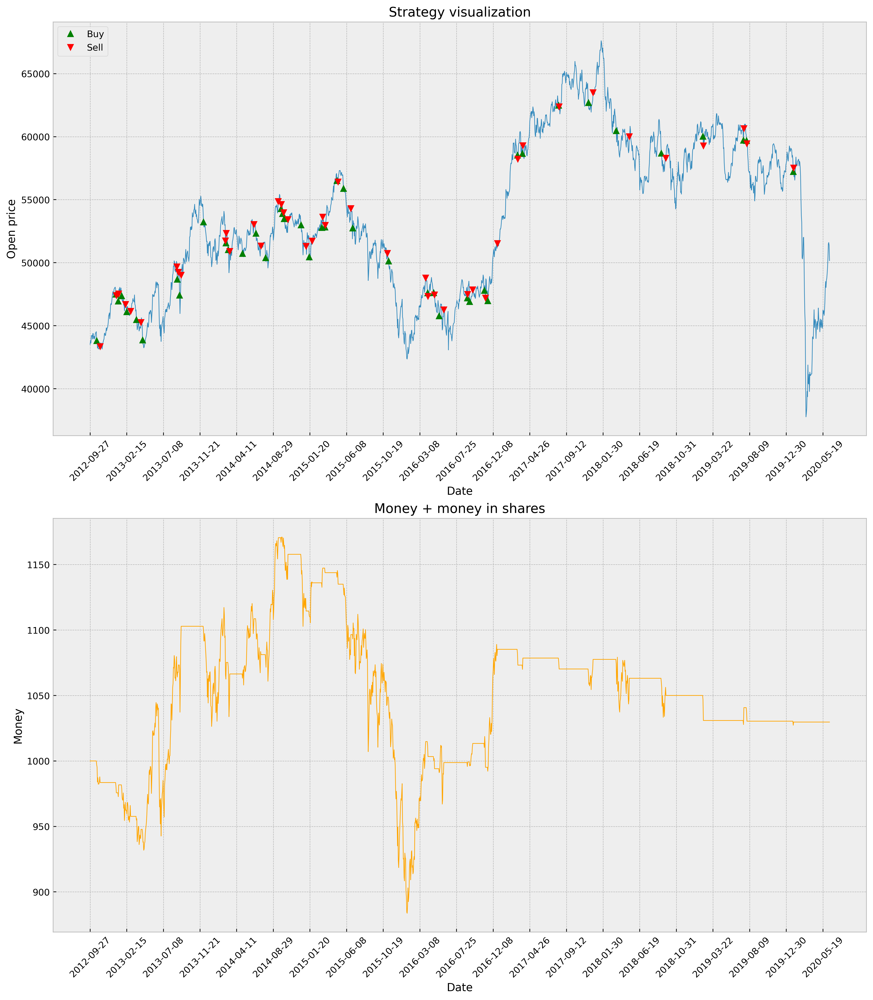

# Etap 6 - Wyniki projektu
## Parametry symulacji
Przed uruchomieniem dłuższych testów skupiliśmy się na dobraniu parametrów symulacji.

### LAMBDA
Uruchamiając symulacje lokalnie najlepsze wyniki dawała wartość: --LAMBDA=50

### N_RESTARTS, MAX_N_GENERATIONS
Przyjęliśmy maksymalnie osiągane wartości z pewnym zapasem: --N_RESTARTS=10000 --MAX_N_GENERATIONS=20000

### SIGMA
Przeprowadziliśmy kilka symulacji na Aresie

parametry joba:
| parametr      | wartość  |
|---------------|----------|
| time          | 02:00:00 |
| ntasks        | 1        |
| cpus-per-task | 12       |

wyniki:
| sigma     | najlepsza strategia                                                      | result (start=1000) | ilość wytrenowanych strategii |
|-----------|--------------------------------------------------------------------------|---------------------|-------------------------------|
| 100       | sigma100_2024-05-13_00-33-35-247771/cmaes_2024-05-13_01-37-30-939889     | 6583.614477         | 11                            |
| 1_000     | sigma1000_2024-05-13_00-33-35-253752/cmaes_2024-05-13_02-28-48-234969    | 8112.268314         | 10                            |
| 10_000    | sigma10000_2024-05-13_00-34-16-900634/cmaes_2024-05-13_02-26-30-987675   | 7698.077003         | 7                             |
| 10_000    | sigma10000_2024-05-16_07-26-14-054703/cmaes_2024-05-16_08-45-42-077338   | 7038.362762         | 7                             |
| 100_000   | sigma100000_2024-05-16_07-26-10-154392/cmaes_2024-05-16_09-18-10-338989  | 6547.543665         | 8                             |
| 1_000_000 | sigma1000000_2024-05-16_07-26-09-711305/cmaes_2024-05-16_08-17-00-179379 | 7326.664081         | 6                             |

--SIGMA=1000 wygenerowała najlepszą strategię ponadto w tym czasie udało się wytrenować drugą największą ilość strategii co również jest korzystne

## Dłuższe testy
Uruchomiliśmy symulacje dla akcji PKN Orlen (02.01.2004 - 30.12.2013), startowy kapitał 1000. \
Następnie wygenerowane strategie przetestowaliśmy na indeksie WIG (14.04.2011 - 12.06.2020).

parametry joba:
| parametr      | wartość  |
|---------------|----------|
| time          | 12:00:00 |
| ntasks        | 1        |
| cpus-per-task | 12       |

### --COMMISSION=0
strategia: commission0_000perc_2024-05-18_17-33-12-213006/cmaes_2024-05-18_20-50-48-335702 \
result: 172146.737095

#### PKN

#### WIG

### --COMMISSION=0.001
strategia: commission0_001perc_2024-05-19_07-57-03-469936/cmaes_2024-05-19_08-08-38-178270 \
result: 128976.255299

#### PKN

#### WIG

### --COMMISSION=0.003
strategia: commission0_003perc_2024-05-18_17-33-14-977267/cmaes_2024-05-19_02-09-48-244080 \
result: 17533.112948

#### PKN

#### WIG

### Wnioski
- uzyskane strategie nie są uniwersalne
- wyższe commission - mniejszy wynik
